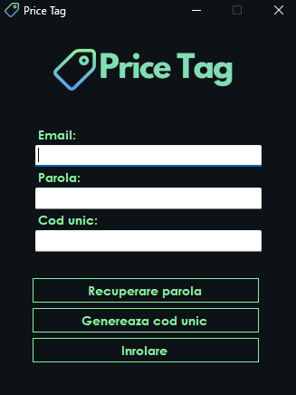
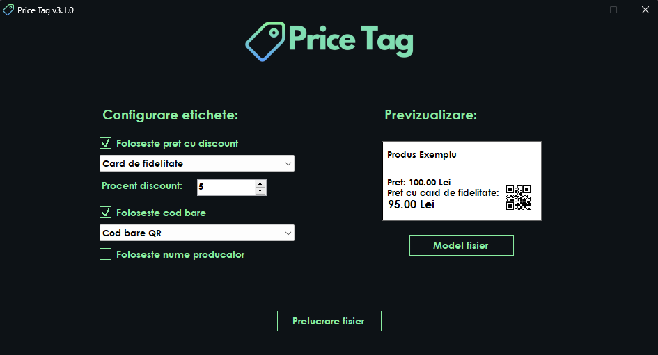
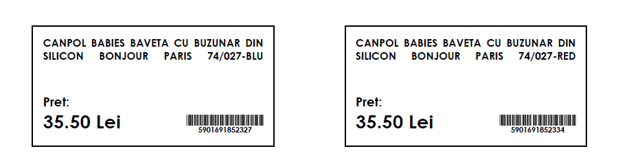
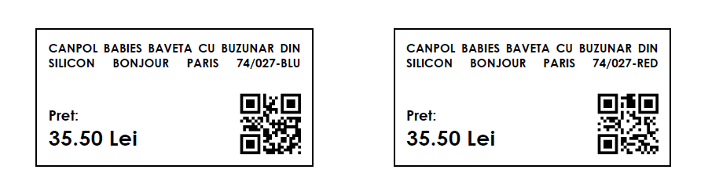
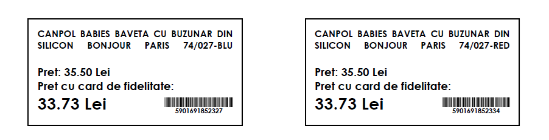
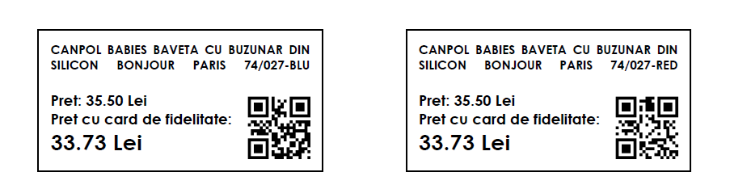

# PriceTag

Price Tag is a C# WinForms (.NET 8) application that generates price labels with product name, price, discounted price, producer name, and either a classic barcode or a QR code **(license required)**.

---

## Key features
- **Excel template on click** — Use **Model fisier** to generate an Excel with the required columns.
- **Discount options** — *Card de fidelitate* or *Reducere promotionala* with a custom percentage. The label shows *Pret cu card de fidelitate* or *Pret promotional* accordingly.
- **Producer name (optional)** — If missing, the app asks whether to continue; when accepted, the producer line is hidden for that product.
- **Barcode or QR** — Choose between classic barcode or QR code per label.
- **PDF export** — Labels are exported directly to PDF.

## Licensing & enrollment
- The license is validated against your **colectie/societate** in the backend.
- First run requires enrollment:
  1. Enter **Email** and **Parola**.
  2. Click **Genereaza cod unic** — you receive a one-time code via email (valid for 24h).
  3. Complete enrollment; a **GUID** tied to your company is generated and saved locally in `PriceTag.xml` (in the app root folder).
- If the license is not valid, the app shows:  
  **„Licenta actuala nu este valida! Contactati echipa de suport!”**

## Input & output
- **Input**: Excel generated via **Model fisier** (contains all required headers).
- **Output**: PDF file with the rendered labels.

## Barcode & QR details
- **Barcode**: Code 39 (start/stop `*`, narrow/wide pattern).  
  *Implementation uses GDI+ to render a bitmap; then converted to `XImage` for PDF.*
- **QR code**: Generated with **QRCoder** (`ECCLevel.Q`).  
  *Payload is whatever you feed from the input (e.g., SKU/text/URL).*

## Requirements
- Windows 10/11
- .NET 8 Runtime  
- No external dependencies beyond those bundled with the app
- UI language: **Romanian**

## Install & run
1. Download and extract the release.
2. Run `PriceTag.exe`.
3. Complete the **inrolare** (enrollment) flow on first launch.
4. Configure label options (discount, barcode/QR, producer name).
5. Click **Model fisier** to generate the Excel template, fill it in, then **Prelucrare fisier** to export PDF.

## Updates
- Manual distribution for now (no auto-update).

## Screenshots

  

  

### Output examples

  
  

  
  

## Notes
- `PriceTag.xml` (with the company GUID and basic settings) is saved in the **application root**.
